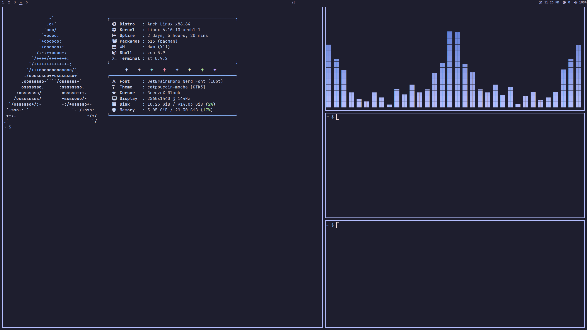
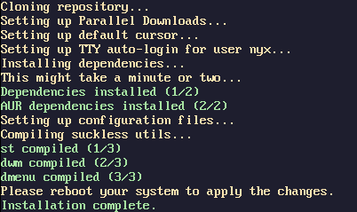

<p align="center">
  
</p>

<hr>

<div align="center">
  <h2>Usage</h2>
</div>

Install via curl
  ```shell
  curl -fsSL https://github.com/nnyyxxxx/dwm/raw/main/install.sh | sh
  ```

Install via git
  ```shell
  git clone https://github.com/nnyyxxxx/dwm
  cd dwm
  chmod +x install.sh
  ./install.sh
  ```

Starting dwm
- DWM is auto-started from tty1 via autologin and zprofile only after rebooting / logging out & logging back in.

Updating dotfiles
- To sync your clone of DWM with the latest version, you can use the following command:
  ```shell
  curl -fsSL https://github.com/nnyyxxxx/dwm/raw/main/update.sh | sh
  ```

Uninstalling dotfiles
- To uninstall the dotfiles, you can use the following command:
  ```shell
  curl -fsSL https://github.com/nnyyxxxx/dwm/raw/main/uninstall.sh | sh
  ```
> [!NOTE]  
> This will restore any previous configuration files overwritten by the install script.

> [!IMPORTANT]  
> This rice relies on having a permament existing ``dwm/`` directory. Do **NOT** remove the directory after setup.
> Any changes to the dotfiles should be made in the ``dwm/`` directory, any changes made in ``~/.config/`` will **NOT** work.

<div align="center">
  <h2>Information</h2>
</div>

Important notes
- These dotfiles use zsh as the default shell, and as such be prepared to manually set up your shell if you do not plan on using zsh.
- The DWM folder in your home directory is used as the primary configuration folder, if you remove it every symlink created by the install script will cease to work; and if you want to change anything inside of the dotfiles it is recommended that you make your changes in the DWM folder. Most of the configuration is done in the extra directory, that is where you'll find all of the important config files.
- The install script will nuke any existing symlinks in your home dir, if you want to keep them, make sure to back them up before running it.

<div align="center">
  <h2>Keybinds overview</h2>
</div>

| Keybind | Description |  
| --- | --- |  
| `ALT SHIFT + Enter` | Spawns st (Terminal) |  
| `ALT SHIFT + P` | Spawns dmenu (Application launcher) |  
| `ALT SHIFT + C` | Kills current window |  
| `ALT SHIFT + Q` | Kills dwm |  
| `ALT SHIFT + W` | Restarts dwm and keeps application positions |
| `ALT SHIFT + F` | Toggles fullscreen (Actualfullscreen Patch) |
| `ALT + Q` | Spawns librewolf (Browser) |
| `ALT + ESC` | Spawns maim (Screenshot utility) | 
| `ALT + LMB` | Drags selected window |
| `ALT + RMB` | Resizes window in floating & resizes mfact in tiled; when two or more windows are on screen |
| `ALT + SPACE` | Makes the selected window float |
| `ALT + R` | Resets mfact |

<div align="center">
  <h2>Preview</h2>
</div>



<div align="center">
  <h2>Script previews</h2>
</div>

<p align="center">
  
</p>

<p align="center">
  
</p>

<p align="center">
  
</p>